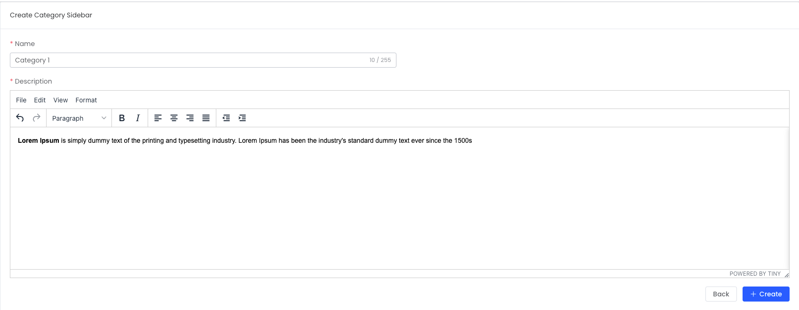

# LaraJS Form

## 🌟 Introduction

We utilize [Element Plus Form](https://element-plus.org/en-US/component/form.html#form) and `JSX` to create the dynamic `LaraForm` component. This allows for seamless form handling with responsive UI elements.

```vue
<script setup lang="ts">
import { useCategoryForms } from "./form.tsx";

const { id, form, state, formElement } = useCategoryForms();
</script>

<template>
  <LaraForm :form="formElement" />
</template>
```

**UI Preview**

<center>
    
</center>

## 🔧 Form.tsx

Here’s the TypeScript code that powers the form logic and setup, providing full control over form structure, validation, and submission.

```tsx
export function useCategoryForms() {
  ...
  const formRef = ref<FormInstance>();
  const form = reactive<Category>({
    id: 0,
    name: "",
    description: "",
  });
  const formElement: LaraFormType<Category> = {
    ...
    name: "category",
    ref: formRef,
    form: {
      model: form,
      rules: categoryRules(),
    },
    items: [
      {
        prop: "name",
        col: {
          span: 12,
        },
        component: () => (
          <el-input
            v-model={form.name}
            show-word-limit
            maxlength={255}
            class="w-full"
          />
        ),
      },
      {
        prop: "description",
        col: {
          span: 24,
        },
        component: () => <Tinymce v-model={form.description} />,
      },
    ],
    actions: {
      create: createCategory,
      update: updateCategory,
    },
  };

  return {
    id,
    form,
    state,
    formElement,
  };
}
export function categoryRules(): FormRules {
  const {t} = useI18n();

  return {
    name: [
      {
        required: true,
        message: t("validation.required", {
          attribute: t("table.category.name"),
        }),
        trigger: "change",
      },
    ],
  };
}
```

## ⚙️ Form Attributes

| **Name** | **Description**                                                                                                                                              | **Type**            | **Default**                                                  |
| -------- | ------------------------------------------------------------------------------------------------------------------------------------------------------------ | ------------------- | ------------------------------------------------------------ |
| name     | Used for integration with `i18n` and `router`, providing localization support and route handling for form data.                                              | `string`            | —                                                            |
| ref      | Provides a reference to access the `LaraForm` component, allowing for programmatic interaction with the form.                                                | `Ref` \| `null`     | —                                                            |
| form     | Inherits properties from the [Form API](https://element-plus.org/en-US/component/form.html#form-api), giving full control over form behavior and appearance. | `Form`              | —                                                            |
| row      | Inherits properties from the [Row API](https://element-plus.org/en-US/component/layout.html#row-api), allowing layout control of form rows.                  | `Partial<RowProps>` | —                                                            |
| items    | Defines the form fields dynamically, allowing customization of the form layout, components, and input elements.                                              | `Items`             | —                                                            |
| actions  | Specifies API actions for the form, such as create or update, and allows custom actions to handle form submissions.                                          | `IAction`           | `[{template: 'cancel'},{template: id ? 'update' : 'store'}]` |
