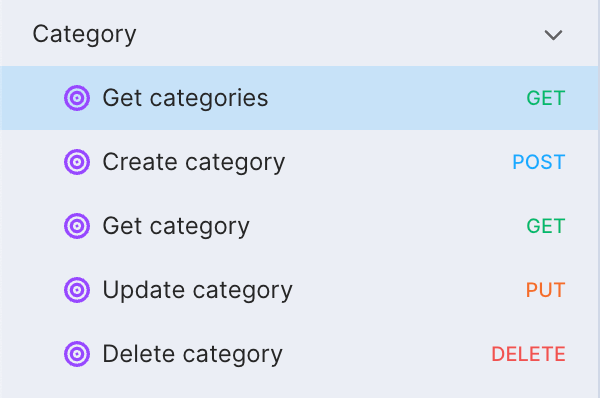

We generate the API according to the following structure

```txt

.
├── apps
│   ├── api
│   │   ├── app
│   │   │   ├── Http
│   │   │   │   ├── Controllers
│   │   │   │   │   ├── Api
│   │   │   │   │   │   └── V1
│   │   │   │   │   │       └── CategoryController.php
│   │   │   │   ├── Requests
│   │   │   │   │   └── V1
│   │   │   │   │       └── StoreCategoryRequest.php
│   │   │   │   └── Resources
│   │   │   │       └── V1
│   │   │   │           └── CategoryResource.php
│   │   │   ├── Models
│   │   │   │   └── Category.php
│   │   │   ├── Repositories
│   │   │   │   └── Category
│   │   │   │       ├── CategoryRepository.php
│   │   │   │       └── CategoryRepositoryInterface.php
│   │   │   └── Services
│   │   │       └── V1
│   │   │           └── Category
│   │   │               └── CategoryService.php
│   │   ├── database
│   │   │   ├── factories
│   │   │   │   └── CategoryFactory.php
│   │   │   ├── migrations
│   │   │   │   └── 2024_10_03_023029_create_categories_table.php
│   │   │   └── seeders
│   │   │       └── CategorySeeder.php
│   │   ├── lang
│   │   │   ├── en
│   │   │   │   ├── route.php
│   │   │   │   └── table.php
│   │   │   ├── ja
│   │   │   │   ├── route.php
│   │   │   │   └── table.php
│   │   │   └── vi
│   │   │      ├── route.php
│   │   │      └── table.php
│   │   ├── routes
│   │   │   └── api-v1.php
│   │   └── tests
│   │       └── Feature
│   │           └── CategoryTest.php
│   ├── cms
│   └── frontend
├── packages
└── ...
```

## Form Request

```php
<?php

namespace App\Http\Requests\V1;

class StoreCategoryRequest extends FormRequest
{
    public function authorize(): bool
    {
        return true;
    }

    public function rules(): array
    {
        return [
            // validation
        ];
    }
}
```

## Controller

```php
<?php

namespace App\Http\Controllers\Api\V1;

class CategoryController extends Controller implements HasMiddleware
{
    public function __construct(private readonly CategoryService $categoryService) {}

    public static function middleware(): array
    {
        // Middleware instance is used to enforce specific permissions on different actions
    }

	public function index(Request $request): JsonResponse
	{
        // Find all
	}

	public function store(StoreCategoryRequest $request): JsonResponse
	{
        // Create
	}

	public function show(int $id, Request $request): JsonResponse
	{
        // Find One
	}

    public function update(int $id, StoreCategoryRequest $request): JsonResponse
	{
        // Update
	}

    public function destroy(int $id): JsonResponse
    {
        // Delete
    }
}
```

## Service

```php
<?php

namespace App\Services\V1\Category;

readonly class CategoryService
{
    /**
     * @param  CategoryRepositoryInterface<Category>  $categoryRepository
     */
    public function __construct(private CategoryRepositoryInterface $categoryRepository) {}

    public function findAll(Request $request): LengthAwarePaginator|CursorPaginator|Paginator|Collection
    {
        // Find All
    }

    public function create(array $data): Category
    {
        // Create
    }

    public function find(int $id, Request $request): Category
    {
        // Find One
    }

    public function update(int $id, array $data): Category
    {
        // Update
    }

    public function delete(int $id): bool
    {
        // Delete
    }
}
```

## Repository

**CategoryRepository.php**

```php
<?php

namespace App\Repositories\Category;

/**
 * @template T of Category
 *
 * @implements CategoryRepositoryInterface<T>
 *
 * @extends  BaseRepository<T>
 */
class CategoryRepository extends BaseRepository implements CategoryRepositoryInterface
{
    public function getModel(): string
    {
        return Category::class;
    }
}
```

**CategoryRepositoryInterface.php**

```php
<?php

namespace App\Repositories\Category;

/**
 * @template T
 *
 * @extends BaseRepositoryInterface<T>
 */
interface CategoryRepositoryInterface extends BaseRepositoryInterface {}
```

## Api Document

We leverage [Laravel Scribe](https://scribe.knuckles.wtf/laravel/) to automatically generate API documentation.

```php
php artisan scribe:generate
```

**{url}/docs**

<center>
    
</center>

## Eloquent Resource

```php
<?php

namespace App\Http\Resources\V1;

class CategoryResource extends JsonResource
{
    public function toArray(Request $request): array
    {
        return parent::toArray($request);
    }
}
```

## Model

```php
<?php

namespace App\Models;

class Category extends Model
{
	use HasFactory;
	use UserSignature; // Checked `User Signature`
    use SoftDeletes; // Checked `Soft Deletes`

    protected $table = 'categories';
    protected $fillable = [
    	// columns in table
    ];
}
```

## Database

### Factory

```php
<?php

namespace Database\Factories;

class CategoryFactory extends Factory
{
    protected $model = Category::class;

    public function definition(): array
    {
        return [
            // faker
        ];
    }
}
```

### Migration

```php
<?php

return new class extends Migration
{
    public function up()
    {
        Schema::create('categories', function (Blueprint $table) {
			$table->bigIncrements("id");
            // columns
        });
    }

    public function down()
    {
        Schema::dropIfExists('categories');
    }
};

```

### Seed

```php
<?php

namespace Database\Seeders;

class CategorySeeder extends Seeder
{
    public function run(): void
    {
        Category::factory()->count(10)->create();
    }
}
```

## Language

**route.php**

```php
<?php
return [
    ...
    // START - category
    'category' => 'Category Sidebar',
    'category_overview' => 'List Category Sidebar',
    'category_create' => 'Create Category Sidebar',
    'category_edit' => 'Edit Category Sidebar',
];
```

**table.php**

```php
<?php
return [
    ...
    // START - category
    'category' => [
        'id' => 'ID',
        ...
    ]
];
```

By default, we generate language configurations for en (English), ja (Japanese), and vi (Vietnamese). If you need to add more languages, you can extend the configuration by following these steps:

1. Publish the `generator.php` configuration file by running the command:
```php
php artisan vendor:publish --tag=larajs-core-config
```
2. After publishing, you can add new language entries in the lang array within the configuration file:
```php
return [
    'lang' => [
        'en' => [
            'route' => '',  // Define localized route names for English
            'table' => '',  // Define table labels for English
        ],
        'ja' => [
            'route' => '',  // Define localized route names for Japanese
            'table' => '',  // Define table labels for Japanese
        ],
        'vi' => [
            'route' => '',  // Define localized route names for Vietnamese
            'table' => '',  // Define table labels for Vietnamese
        ],
        // Add additional languages here
    ],
]
```

**Generate I18n**

```php
// Synchronize i18n language settings for the frontend.
php artisan larajs:i18n
// packages/common/src/lang/vue-i18n-locales.generated.json
```

**Structure**

```txt
.
├── en
│   ├── route.php
│   ├── table.php
│   └── ...
├── ja
│   ├── route.php
│   ├── table.php
│   └── ...
└── vi
    ├── route.php
    ├── table.php
    └── ...
```

## Route

**api-v1.php**

```php
<?php
Route::group(['middleware' => 'auth:sanctum'], function () {
    ...
    Route::apiResource('categories', CategoryController::class);
});

```

## Tests

When the `Test Cases` option is checked, we automatically generate integration tests to ensure the API functions correctly.

```php
<?php

uses(WithFaker::class);

beforeEach(function () {
    $faker = $this->faker;
    $this->data = [
        // faker
    ];
});

test('get list categories -> 200', function () {
    Category::factory()->count(5)->create();
    // Call Api
    // Expect
});

test('show a category -> 200', function () {
    $category = Category::factory()->create();
    // Call Api
    // Expect
});

test('store a category -> 201', function () {
    // Call Api
    // Expect
});

test('update a category -> 200', function () {
    $category = Category::factory()->create();
    // Call Api
    // Expect
});

test('destroy a category -> 200', function () {
    $category = Category::factory()->create();
    // Call Api
    // Expect
});
```

**Run tests**

We leverage [Pest PHP](https://pestphp.com/) to generate tests.

```php
php artisan test
```
Output

```bash
...
PASS  Tests\Feature\CategoryTest
✓ get list categories -> 200                                 0.04s  
✓ show a category -> 200                                     0.02s  
✓ store a category -> 201                                    0.02s  
✓ update a category -> 200                                   0.02s  
✓ destroy a category -> 200                                  0.02s 
...
```