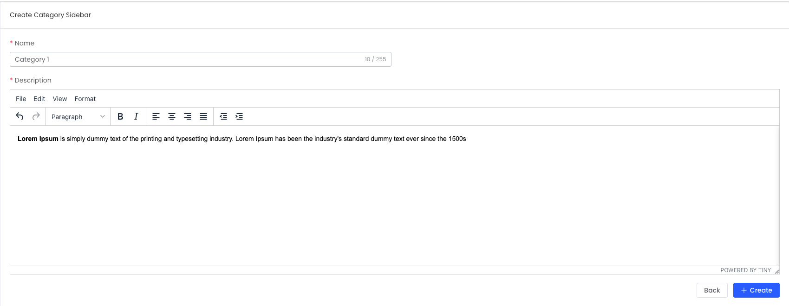
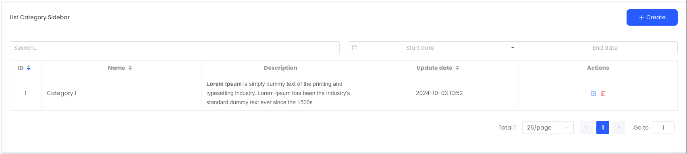

# CMS Structure (Monorepo)

We generate the CMS according to the following structure

```txt
.
├── apps
│   ├── api
│   ├── cms
│   │   └── src
│   │       ├── api
│   │       │   └── category.ts
│   │       ├── router
│   │       │   ├── index.ts
│   │       │   └── modules
│   │       │       └── category.ts
│   │       ├── uses
│   │       │   └── category
│   │       │       ├── form.tsx
│   │       │       └── table.tsx
│   │       └── views
│   │           └── category
│   │               ├── Form.vue
│   │               └── index.vue
│   └── frontend
├── packages
│   ├── ...
│   └── common
│       ├── src
│       │   └── vue-i18n-locales.generated.json
│       └── models
│           └── category.ts
└── ...
```

## API Integration

```ts
class CategoryResource extends Resource<Category> {
  constructor() {
    super("/v1/categories");
  }
}

export function useCategoryApis() {
  const categoryResource = new CategoryResource();

  const getCategories = (query: IQuery, props?: AxiosRequestConfig) =>
    categoryResource.getAll(query, props);
  const getCategory = (id: number | string, props?: AxiosRequestConfig) =>
    categoryResource.getOne(id, props);
  const createCategory = (data: Category, props?: AxiosRequestConfig) =>
    categoryResource.create(data, props);
  const updateCategory = (
    id: number | string,
    data: Partial<Category>,
    props?: AxiosRequestConfig
  ) => categoryResource.update(id, data, props);
  const deleteCategory = (id: number | string, props?: AxiosRequestConfig) =>
    categoryResource.delete(id, props);

  return {
    getCategories,
    getCategory,
    createCategory,
    updateCategory,
    deleteCategory,
  };
}
```

## Router Setup

There are two types of routes here , `constantRoutes` and `asyncRoutes`.

**1. constantRouterMap**

Represents routes that do not require dynamic access control and do not require authentication.

```ts
export const constantRouterMap: RouterMapping[] = [
  // router
];
```

**2. asyncRouterMap**

Represents pages that require authentication and are dynamically loaded based on the permissions of the current user.

```ts
export const asyncRouterMap = [
  ...,
  category, // loaded based on the permissions of the current user
  {
    path: "/:pathMatch(.*)*",
    redirect: "/404",
    hidden: true,
  },
];
```

**Category Route Definition (category.ts)**

```ts
const category: RouterMapping = {
  path: '/categories',
  name: 'Category',
  meta: {
    ...
    permissions: [PermissionType.VISIT],
  },
  ...
  children: [
    {
      // List
    },
    {
      // Form Create
    },
    {
      // Form Edit
    },
  ],
};

export default category;
```

## Uses (Hooks)

**Category Forms (form.tsx)**

```tsx
export function useCategoryForms() {
  const route = useRoute();
  const { t } = useI18n();
  const id = route.params.id as string;
  const { createCategory, updateCategory } = useCategoryApis();
  const formRef = ref<FormInstance>();
  const form = reactive<Category>({
    id: 0,
    // columns
  });
  const formElement: LaraFormType<Category> = {
    name: "category",
    ref: formRef,
    form: {
      model: form,
      rules: categoryRules(),
    },
    items: [
      // components
    ],
    actions: {
      create: createCategory,
      update: updateCategory,
    },
  };
  return {
    id,
    form,
    state,
    formElement,
  };
}
export function categoryRules(): FormRules {
  return {
    // validation
  };
}
```

**Category Table (table.tsx)**

```tsx
export function useCategoryTables() {
  const { getCategories, deleteCategory } = useCategoryApis();
  const { t } = useI18n();
  const table: LaraTableType<Category> = {
    name: "category",
    actions: {
      getAll: getCategories,
      delete: deleteCategory,
    },
    query: {
      orderBy: "-id", // orderby
      include: [], // get relationship
      search: {
        column: "name,content,posts.name", // Where like with columns
      },
      date: {
        column: "categories.updated_at", // Filter between data with column
      },
      filter: "", // Similar https://www.jsonapi.net/usage/reading/filtering.html
      select: "id,name", // Specific select columns
      pagination: {
        page: 1,
        cursor: "string",
        limit: 25,
        type: "default", // 'simple' | 'cursor' | 'default';
      },
      // add any query string
    },
    columns: [
      {
        field: "id",
        type: "string",
        width: 80,
        sortable: "custom",
        align: "center",
        headerAlign: "center",
      },
      //
    ],
  };
  return {
    table,
  };
}
```

## Views

**Form.vue**

```vue
<script setup lang="ts">
const { t } = useI18n();
const { id, form, state, formElement } = useCategoryForms();
const { getCategory } = useCategoryApis();
const coreStore = useCoreStore();
const cancelToken = useCancelToken();

onBeforeMount(async () => {
  coreStore.setLoading(true);
  if (id) {
    const {
      data: { data: category },
    } = await getCategory(id, { cancelToken });
    objectAssign(form, category);
  }
  coreStore.setLoading(false);
});
</script>

<template>
  <el-card>
    <template #header>
      <h3>{{ id ? t("route.category_edit") : t("route.category_create") }}</h3>
    </template>
    <LaraForm :form="formElement" />
  </el-card>
</template>
```

**UI Preview**

<center>
  
</center>

**index.vue**

```vue
<script setup lang="ts">
const { t } = useI18n();
const { table } = useCategoryTables();
</script>

<template>
  <el-card>
    <template #header>
      <div class="flex items-center justify-between">
        <h3>{{ t("route.category_overview") }}</h3>
        <router-link
          v-slot="{ href, navigate }"
          :to="{ name: 'CategoryCreate' }"
          custom
        >
          <a
            v-permission="[PermissionType.CREATE]"
            :href="href"
            class="pan-btn pan--primary"
            @click="navigate"
          >
            <el-icon class="el-icon--left">
              <IconPlus />
            </el-icon>
            {{ t("button.store") }}
          </a>
        </router-link>
      </div>
    </template>
    <LaraTable :table="table" />
  </el-card>
</template>
```

**UI Preview**

<center>
  
</center>

## Model Interface

```ts
export interface Category {
  id: number;
  // columns
}
```
