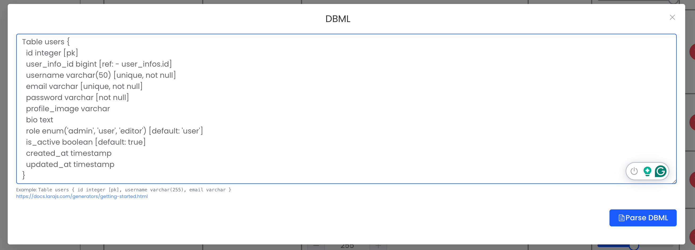
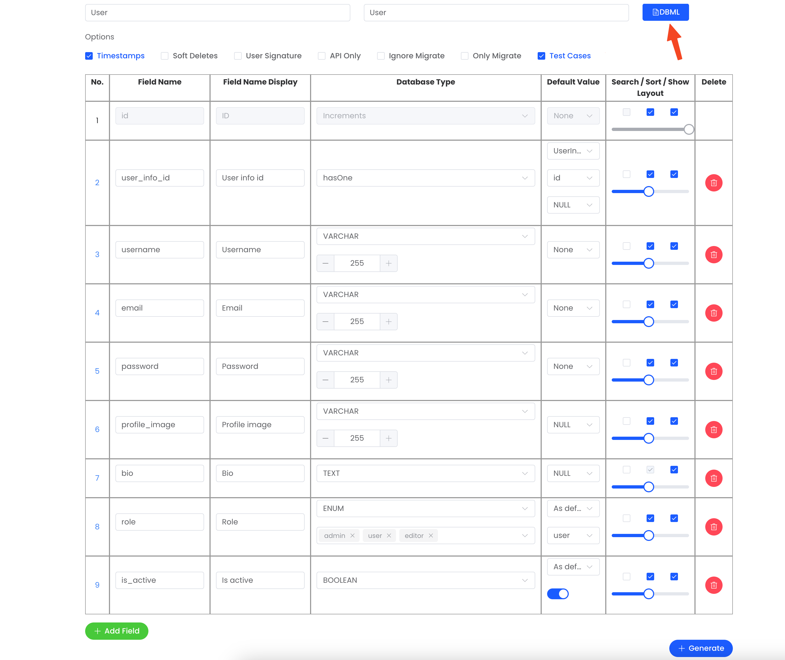

# Generator Overview

The **Generator** allows users to define and configure models along with their fields for a Laravel application. Users can customize the model name, fields, relationships, and other attributes that will be used to generate the backend API, database, and frontend CMS.

**UI Preview**


## Model Configuration

| **Field**            | **Description**               | **Default** | **Example**        | **Validation** |
| -------------------- | ----------------------------- | ----------- | ------------------ | -------------- |
| `Model Name`         | Defines the name of the model |             | `Category`         | Required       |
| `Model Name Display` | Display name in menu bar      |             | `Category Sidebar` | Required       |

## Options

| **Field**        | **Description**                                                                  | **Default** | **Example** | **Validation** |
| ---------------- | -------------------------------------------------------------------------------- | ----------- | ----------- | -------------- |
| `Timestamps`     | Automatically adds `created_at` and `updated_at` columns to the table.           | Checked     |             | Optional       |
| `Soft Deletes`   | Adds support for soft deletion (adds a `deleted_at` column).                     | Checked     |             | Optional       |
| `User Signature` | Adds `created_by` and `updated_by` columns to track who created/updated records. | UnChecked   |             | Optional       |
| `APi Only`       | Only generate the API                                                            | UnChecked   |             | Optional       |
| `Ignore Migrate` | Skips running database migrations.                                               | UnChecked   |             | Optional       |
| `Only Migrate`   | Only generate migration and Model.                                               | UnChecked   |             | Optional       |
| `Test Cases`     | Generates test cases for the model and related services.                         | Checked     |             | Optional       |

## Fields Configuration

| **Field**                 | **Description**                                                                                                    | **Default**    | **Example**    | **Validation** |
| ------------------------- | ------------------------------------------------------------------------------------------------------------------ | -------------- | -------------- | -------------- |
| `Field Name`              | The name of the field in the database.                                                                             |                | `name`         | Required       |
| `Field Name Display`      | Display name for the field in the user interface.                                                                  |                | `Name`         | Required       |
| `Field Option`            | Setting unique, indexing, and adding comments.                                                                     |                |                | Optional       |
| `Database Type`           | The type of the field in the database (e.g., `Increments`, `VARCHAR`, `LONGTEXT`).                                 | `VARCHAR(255)` | `VARCHAR(255)` | Required       |
| `Default Value`           | The default value for this field if none is provided.                                                              | `NULL`         |                | Required       |
| `Search/Sort/Show/Layout` | On/Off `search`, `sort`, and `show` in the table. The column `layout` can be adjusted to a value between 1 and 24. |                |                | Optional       |
| `Delete`                  | Option to delete the field from the configuration.                                                                 |                |                |                |

### 🔧 Field Option

| **Option** | **Description**                                                                                   | **Example**                                         |
| ---------- | ------------------------------------------------------------------------------------------------- | --------------------------------------------------- |
| `Unique`   | Ensures the field value is unique across all records in the database.                             | Enabled for `email` field to ensure unique emails.  |
| `Index`    | Creates an index on the field to optimize database query performance.                             | Enabled for `status` field to improve search speed. |
| `Comment`  | Adds a comment for the field in the database, useful for documentation or clarification purposes. | Indicates if the category is active or inactive.    |

**UI Preview**


### 📦 Database Type

#### 🗄️ Database

| **Database Type**       | **Display Name**   | **Search** | **Sort** | **Show** |
| ----------------------- | ------------------ | :--------: | :------: | :------: |
| `increments`            | Increments         |     🚫     |    ✅    |    ✅    |
| `integer`               | INTEGER            |     ✅     |    ✅    |    ✅    |
| `unsignedInteger`       | UNSIGNED INTEGER   |     ✅     |    ✅    |    ✅    |
| `tinyInteger`           | TINYINT            |     ✅     |    ✅    |    ✅    |
| `unsignedTinyInteger`   | UNSIGNED TINYINT   |     ✅     |    ✅    |    ✅    |
| `smallInteger`          | SMALLINT           |     ✅     |    ✅    |    ✅    |
| `unsignedSmallInteger`  | UNSIGNED SMALLINT  |     ✅     |    ✅    |    ✅    |
| `mediumInteger`         | MEDIUMINT          |     ✅     |    ✅    |    ✅    |
| `unsignedMediumInteger` | UNSIGNED MEDIUMINT |     ✅     |    ✅    |    ✅    |
| `bigInteger`            | BIGINT             |     ✅     |    ✅    |    ✅    |
| `unsignedBigInteger`    | UNSIGNED BIGINT    |     ✅     |    ✅    |    ✅    |
| `float`                 | FLOAT              |     ✅     |    ✅    |    ✅    |
| `double`                | DOUBLE             |     ✅     |    ✅    |    ✅    |
| `decimal`               | DECIMAL            |     ✅     |    ✅    |    ✅    |
| `boolean`               | BOOLEAN            |     ✅     |    ✅    |    ✅    |
| `date`                  | DATE               |     ✅     |    ✅    |    ✅    |
| `dateTime`              | DATETIME           |     ✅     |    ✅    |    ✅    |
| `timestamp`             | TIMESTAMP          |     ✅     |    ✅    |    ✅    |
| `time`                  | TIME               |     ✅     |    ✅    |    ✅    |
| `year`                  | YEAR               |     ✅     |    ✅    |    ✅    |
| `char`                  | CHAR               |     ✅     |    ✅    |    ✅    |
| `string`                | VARCHAR            |     ✅     |    ✅    |    ✅    |
| `tinyText`              | TINYTEXT           |     ✅     |    ✅    |    ✅    |
| `mediumText`            | MEDIUMTEXT         |     ✅     |    ✅    |    ✅    |
| `text`                  | TEXT               |     ✅     |    ✅    |    ✅    |
| `longText`              | LONGTEXT           |     ✅     |    ✅    |    ✅    |
| `enum`                  | ENUM               |     ✅     |    ✅    |    ✅    |
| `json`                  | JSON               |     🚫     |    🚫    |    ✅    |
| `jsonb`                 | JSONB              |     🚫     |    🚫    |    ✅    |
| **Relationship Types**  |                    |            |          |          |
| `hasOne`                | hasOne             |     ✅     |    ✅    |    ✅    |
| `hasMany`               | hasMany            |     ✅     |    ✅    |    ✅    |

#### 📝 Form

Each **Database Type** will feature a distinct UI, with our focus centered on utilizing the **Element Plus** components.

| **Database Type**                                                                                                                                                                           |                          **UI Preview**                          |
| ------------------------------------------------------------------------------------------------------------------------------------------------------------------------------------------- | :--------------------------------------------------------------: |
| `INTEGER`, `UNSIGNED INTEGER`, `TINYINT`, `UNSIGNED TINYINT`, `SMALLINT`, `UNSIGNED SMALLINT`, `MEDIUMINT`, `UNSIGNED MEDIUMINT`, `BIGINT`, `UNSIGNED BIGINT`, `FLOAT`, `DOUBLE`, `DECIMAL` | <center></center> |
| `BOOLEAN`                                                                                                                                                                                   | <center></center> |
| `DATE`                                                                                                                                                                                      |                         |
| `DATETIME`, `TIMESTAMP`                                                                                                                                                                     |                  |
| `TIME`                                                                                                                                                                                      |                         |
| `YEAR`                                                                                                                                                                                      |                         |
| `CHAR`, `VARCHAR`                                                                                                                                                                           |                   |
| `TINYTEXT`, `MEDIUMTEXT`, `TEXT`                                                                                                                                                            |                         |
| `LONGTEXT`                                                                                                                                                                                  |                 |
| `ENUM`                                                                                                                                                                                      |                         |
| `JSON`, `JSONB`                                                                                                                                                                             |                         |

## Relationships

There are two ways to create relationships in our system:

Example:

`Post` → belongs to → `Category`

`Category` → has many → `Post`

### 📝 Generate Form

This way just only for `hasMany` or `belongsTo`

**UI Preview**


### 📝 Relationship Form

This way for all relationship such as: `hasOne`, `hasMany`, `belongsToMany`

**UI Preview**


**🔄 Many To Many**

Many to many will generate pivot table. By default, the pivot table is `CategoryPost` (`{Model1}` + `{Model2}`).

**UI Preview**


```php
<?php

return new class extends Migration
{
    public function up()
    {
        Schema::create('category_post', function (Blueprint $table) {
            $table->foreignId('category_id')->index();
            $table->foreignId('post_id')->index();
            $table->primary(['category_id', 'post_id']);
        });
    }

    public function down()
    {
        Schema::dropIfExists('category_post');
    }
};

```

## DBML <Badge type="warning" text="beta" />

### The DBML Interface

LaraJS provides a clean, user-friendly interface for importing DBML content:




The interface provides:

- A large text area for pasting DBML content
- A reference example to help users understand the syntax
- A link to the official DBML documentation
- A parse button to process the DBML and generate model fields

### Complete Type Mapping Reference

The LaraJS DBML parser supports a comprehensive range of database types, mapping them automatically to their corresponding LaraJS database types:

| **DBML Type**                             | **LaraJS Database Type** |
| ----------------------------------------- | ------------------------ |
| `int`, `integer`                          | `INTEGER`                |
| `tinyint`                                 | `TINYINT`                |
| `smallint`                                | `SMALLINT`               |
| `mediumint`                               | `MEDIUMINT`              |
| `bigint`                                  | `BIGINT`                 |
| `float`                                   | `FLOAT`                  |
| `double`                                  | `DOUBLE`                 |
| `decimal`                                 | `DECIMAL`                |
| `boolean`, `bool`                         | `BOOLEAN`                |
| `date`                                    | `DATE`                   |
| `datetime`                                | `DATETIME`               |
| `timestamp`                               | `TIMESTAMP`              |
| `time`                                    | `TIME`                   |
| `year`                                    | `YEAR`                   |
| `char`                                    | `CHAR`                   |
| `varchar`, `string`                       | `VARCHAR`                |
| `text`                                    | `TEXT`                   |
| `tinytext`                                | `TINYTEXT`               |
| `mediumtext`                              | `MEDIUMTEXT`             |
| `longtext`                                | `LONGTEXT`               |
| `json`                                    | `JSON`                   |
| `jsonb`                                   | `JSONB`                  |
| `enum`                                    | `ENUM`                   |
| `unsigned int`, `unsignedint`             | `UNSIGNED INTEGER`       |
| `unsigned integer`, `unsignedinteger`     | `UNSIGNED INTEGER`       |
| `unsigned tinyint`, `unsignedtinyint`     | `UNSIGNED TINYINT`       |
| `unsigned smallint`, `unsignedsmallint`   | `UNSIGNED SMALLINT`      |
| `unsigned mediumint`, `unsignedmediumint` | `UNSIGNED MEDIUMINT`     |
| `unsigned bigint` , `unsignedbigint`      | `UNSIGNED BIGINT`        |

**Example DBML Syntax:**

```dbml
Table users {
  id integer [pk]
  user_info_id bigint [ref: - user_infos.id]
  username varchar(50) [unique, not null]
  email varchar [unique, not null]
  password varchar [not null]
  profile_image varchar
  bio text
  role enum('admin', 'user', 'editor') [default: 'user']
  is_active boolean [default: true]
  created_at timestamp
  updated_at timestamp
}
```

### Field Attributes and Their Mappings

The DBML parser also handles various field attributes and maps them to appropriate LaraJS configurations:

| **DBML Attribute**    | **LaraJS Equivalent**                            |
| --------------------- | ------------------------------------------------ |
| `pk`                  | Identifies the primary key field                 |
| `not null`            | Sets default value to "None" instead of "NULL"   |
| `unique`              | Enables the "Unique" field option                |
| `index`               | Enables the "Index" field option                 |
| `note: 'text'`        | Sets a comment in the field options              |
| `comment: 'text'`     | Sets a comment in the field options              |
| `default: value`      | Sets default value to "As define" with the value |
| `ref: > table.column` | Creates a "hasMany" relationship to the table    |
| `ref: < table.column` | Creates a "hasOne" relationship with the table   |
| `increment`           | Maps to autoincrement field type                 |

### Relationship Detection

The DBML parser can detect relationships from reference syntax:

- `[ref: > users.id]` detects a hasMany relationship
- `[ref: < comments.post_id]` detects a hasOne relationship

### Best Practices for DBML Import

For the best results when working with DBML in LaraJS:

1. **Field Naming**: Use snake_case for field names in DBML to maintain consistency with Laravel conventions
2. **Relationship Definition**: Explicitly define relationships using the `ref:` syntax to ensure proper relationship detection
3. **Comprehensive Attributes**: Include all necessary attributes like unique constraints, defaults, and comments for complete model generation
4. **Review After Import**: Always review the generated fields after import to ensure they meet your requirements
5. **Incremental Approach**: For complex schemas, consider importing tables one at a time rather than all at once
6. **DBML First Design**: Consider using DBML as your initial database design tool before implementation to streamline the development process

### Handling Complex Data Types

The DBML parser intelligently handles more complex data types:

- **Enum Types**: When using `enum('value1', 'value2')`, LaraJS automatically creates an ENUM field with the provided values
- **Length Specification**: For types like `varchar(255)`, the parser correctly sets the length_varchar property
- **Decimal Precision**: For `decimal`, LaraJS sets up the appropriate decimal configuration

### Troubleshooting Common Issues

| **Issue**                      | **Solution**                                                  |
| ------------------------------ | ------------------------------------------------------------- |
| Relationships not detected     | Ensure you're using the proper `ref:` syntax with direction   |
| Field types not mapping        | Check the type mapping table and use a supported DBML type    |
| Default values not applying    | Use the format `[default: value]` with appropriate quotes     |
| Unique constraints not applied | Make sure to include `[unique]` in the field attributes       |
| Model name not generated       | Check the table name format - it should be `Table name {...}` |
