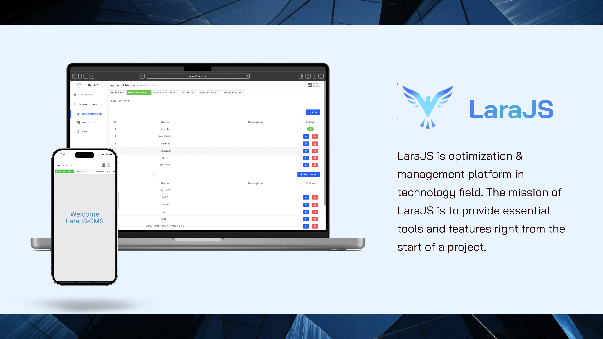

## LaraJS

LaraJS is a **low-code**, beautiful dashboard that combines Laravel, VueJS. It features a code generator, enabling a time savings of about 40-70% for the entire project.

## Features

- Generate code
  - API
    - Route: APIs endpoint
    - FormRequest: Validate input
    - Controller: Handle request
    - Service: Handle logic
    - Repository: Integrate with Database
    - Model: Eloquent model
    - Observer: Listening for many events on a given model
    - Resource: Transformation data response
  - Database
  - Languages
  - Factory
  - API Documents
  - Integration Test
  - UI CMS
- Customization
- Client-Side Querying
- Light/Dark Mode
- Multiples Language
- Support Responsive
- Role Base Access Control
- Code Lint
- Support SSR and SSG
- Monorepo
