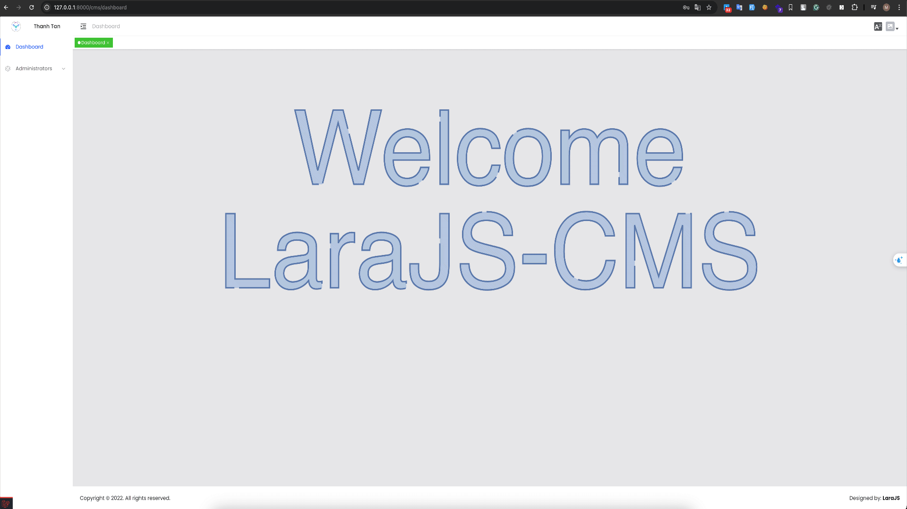

# Why Choose LaraJS? 🚀

::: tip At a Glance
LaraJS accelerates your Laravel and Vue.js development by providing ready-to-use components, standardized code architecture, and powerful generators that save hours of repetitive coding work. Our low-code platform is ideal for developers who want to focus on business logic without sacrificing code quality or performance.
:::

## Key Benefits

### 1. ⚡ Rapid Development with Code Generators

Generate complete API endpoints, forms, and tables with minimal configuration. LaraJS's code generators create coherent, tested code across your entire stack:

- **Backend generation**: Routes, Controllers, Services, Repositories, Models, and more
- **Frontend components**: Vue.js interfaces with minimal configuration
- **Database management**: Migrations, Factories, and Seeders

::: info Productivity Boost
This comprehensive generation approach can reduce development time by **40-70%** compared to traditional approaches, while maintaining high-quality architecture and best practices.
:::

### 2. 🔍 Advanced Querying Capabilities

Build complex API filters without writing backend code. The LaraJS Query package provides:

- **Standardized filtering**: Apply complex filters with minimal configuration
- **Automated sorting**: Client-side and server-side sorting capabilities
- **Efficient pagination**: Optimized for performance with large datasets
- **Seamless integration**: Works consistently between your frontend and backend

### 3. 🏗️ Consistent Architecture and Structure

Maintain code quality across large teams and projects with standardized architecture and patterns:

- **Enforced best practices**: Follow Laravel and Vue.js community standards
- **Predictable file organization**: Know where everything belongs
- **Reduced onboarding time**: New team members become productive faster
- **Architectural consistency**: Avoid common pitfalls and anti-patterns

### 4. 🔧 Production-Ready Components

Start with a solid foundation for enterprise applications. LaraJS incorporates established patterns and practices suitable for large-scale applications:

- **Comprehensive role-based access control**: Granular permissions management
- **Built-in internationalization**: Full i18n support via LaraJS I18n
- **Standardized error handling**: Consistent API error responses
- **Optimized database queries**: Smart query building to prevent N+1 problems
- **Performance-focused UI components**: Responsive and efficient interfaces

### 5. 🧩 Customization and Flexibility

LaraJS provides structure without sacrificing flexibility:

- **Customizable code generation**: Modify templates to fit your needs
- **Themeable interfaces**: Create your own design system or use the defaults
- **Extensible architecture**: Add your own components and patterns
- **Interoperable packages**: Use only what you need from the ecosystem

### 6. 💻 Modern Development Experience

Enhance your development workflow with modern tooling and practices:

- **Light/Dark Mode support**: Built-in theme switching
- **Responsive design**: Mobile-first components
- **Code linting and formatting**: Maintain code quality standards
- **SSR & SSG support**: Server-side rendering and static site generation
- **Monorepo compatibility**: Organize complex projects efficiently

### 7. ⏱️ Time-to-Value Optimization

LaraJS is designed to help you deliver business value faster:

- **Reduced boilerplate code**: Focus on unique business requirements
- **Pre-built common features**: User management, authentication, permissions
- **Testing infrastructure**: Automated test generation for APIs
- **Documentation tools**: Auto-generate OpenAPI documentation

## Real-World Applications

::: details Admin dashboards
Create feature-rich administrative interfaces quickly
:::

::: details Data-heavy applications
Leverage LaraJS Table for complex data presentation
:::

::: details Multi-user systems
Utilize built-in permission management
:::

::: details Enterprise applications
Benefit from the consistent architecture and established patterns
:::

::: details Rapid prototyping
Quickly build MVPs with all the essential features
:::

::: warning Take Your Development to the Next Level
By choosing LaraJS, development teams can focus on delivering business value while maintaining high code quality and performance standards. The platform's integrated approach ensures that all components work together seamlessly, from database to UI.
:::
