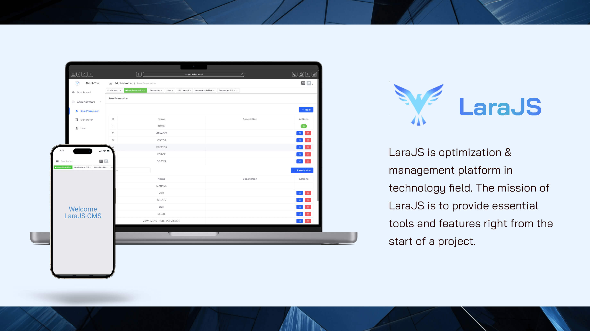
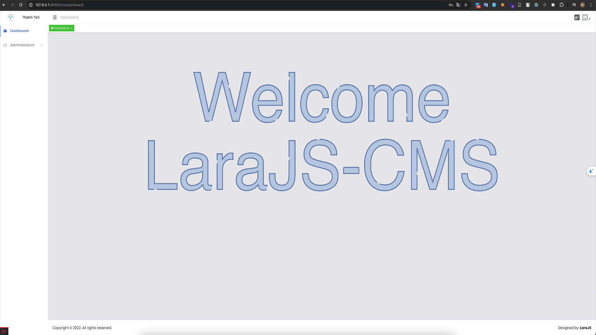

  <strong style="font-size: 18px;color: red;">This document includes features from private repositories.</strong>

## LaraJS

`LaraJS` is a **low-code**, beautifully designed dashboard that combines Laravel and VueJS. It comes with a code generator that can save you about **40-70% of the time** for the entire project development process.

## Key Features

### Generate code

- 🌐 API
  - 🛤️ Route: Define API endpoints.
  - 📝 FormRequest: Validate incoming input.
  - 🗂️ Controller: Handle API requests.
  - 🛠️ Service: Business logic management.
  - 🗄️ Repository: Integrate with the database.
  - 📦 Model: Eloquent ORM for database interaction.
  - 👂 Observer: Listen to model events.
  - 🔄 Resource: Transform data for API responses.
  - 📖 API Documentation: Generate and maintain API docs.
- 🗃️ Database
  - 🏭 Factory: Easily create test data.
  - 🛠️ Migration: Define and apply database schema changes.
  - 🌱 Seeder: Populate the database with initial data.
- 🌍 Languages
- ✅ Integration Tests
- 🎨 UI & Logic

### Customization

- ✏️ Easily customize generated code to fit your needs.
- 🎨 Custom Themes for a tailored design and branding.
- 🔄 Modify Stubs to control generated code structure.

### Additional Features

- 🔍 Client-Side Querying
- 🌗 Light/Dark Mode support
- 🗣️ Multiple Languages
- 📱 Responsive Design
- 🔐 Role-Based Access Control
- 🧹 Code Linting and Formatting
- 🖥️ Support for SSR (Server-Side Rendering) and SSG (Static Site Generation)
- 📦 Monorepo support for organizing projects
