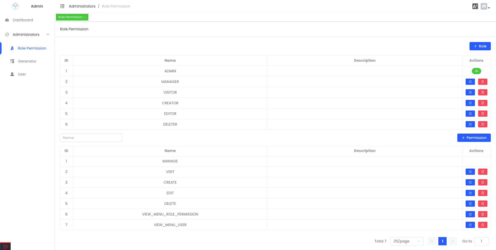
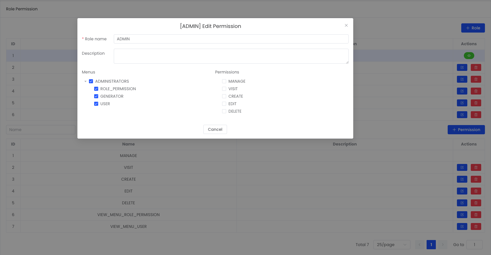

## Introduction

We integrate [Laravel Permission](https://spatie.be/docs/laravel-permission/v6/introduction) to handle role-based access control (RBAC) in our application. This package simplifies the management of user permissions, roles, and access to various resources.

## Getting Started

### Installation

By default, the `/api/v1/me` endpoint returns users with the `ADMIN` role. If you wish to implement more granular role and permission control, you can modify the response in the `AuthResource.php`

**Backend**

1. Install the **larajs-permission** backend package by running the following command:

```bash
composer require larajs/permission:dev-main
```

2. Add `HasRoles` Traits in the `User.php` model

```php
use Spatie\Permission\Traits\HasRoles;

class User extends Authenticatable
{
  use HasRoles;
  // ...
}
``` 

3. Defining a Super-Admin in the `AuthServiceProvider.php` file

```php
<?php

namespace App\Providers;

use LaraJS\Permission\Enums\RoleEnum;

class AuthServiceProvider extends ServiceProvider
{
  public function boot(): void {
    Gate::before(function ($user, $ability) {
        return $user->hasRole(RoleEnum::ADMIN->name) ? true : null;
    });
  }
}
```
4. Set up a user, role, and permission seeder in the `SetupUserRolePermissionSeeder.php` file

```php
<?php

namespace Database\Seeders;

use App\Enums\AuthEnum;
use App\Models\User;
use Illuminate\Database\Seeder;
use LaraJS\Permission\Enums\PermissionEnum;
use LaraJS\Permission\Enums\RoleEnum;
use LaraJS\Permission\Models\Permission;
use LaraJS\Permission\Models\Role;

class SetupUserRolePermissionSeeder extends Seeder
{
  /**
   * Run the database seeds.
   *
   * @return void
   */
  public function run()
  {
      foreach (array_map(fn (RoleEnum $role) => $role->name, RoleEnum::cases()) as $role) {
          Role::findOrCreate($role);
      }

      foreach (
          array_map(fn (PermissionEnum $permission) => $permission->name, PermissionEnum::cases()) as $permission
      ) {
          Permission::findOrCreate($permission);
      }

      $admin = User::create([
        'name' => 'Admin',
        'email' => AuthEnum::USERNAME->value,
        'password' => AuthEnum::PASSWORD->value,
      ]);
      $manager = User::create([
          'name' => 'Manager',
          'email' => 'manager@larajs.com',
          'password' => AuthEnum::PASSWORD->value,
      ]);
      // Find roles
      $adminRole = Role::findByName(RoleEnum::ADMIN->name);
      $managerRole = Role::findByName(RoleEnum::MANAGER->name);
      // Sync Roles
      $admin->syncRoles($adminRole);
      $manager->syncRoles($managerRole);
      // Sync permissions
      $managerRole->givePermissionTo([
          array_map(function (PermissionEnum $permission) {
              return $permission->name;
          }, PermissionEnum::cases()),
      ]);
  }
}
```

**Frontend (Optional)**

To include the Role Permission UI in your CMS, import the component into the administrator module, which is located at: `apps/cms/src/router/modules/administrator.ts`

```ts
const administrator: RouterMapping = {
  path: '/administrators',
  name: 'administrators',
  // ...
  children: [
    {
      path: 'roles',
      name: 'Role',
      component: () => import('@larajs/permission/src/views/role-permission/RolePermission.vue'),
      meta: {
        title: 'role_permission',
        icon: 'role',
        permissions: [PermissionType.MANAGE],
      },
    },
    // ...
  ],
};
```
**UI**



